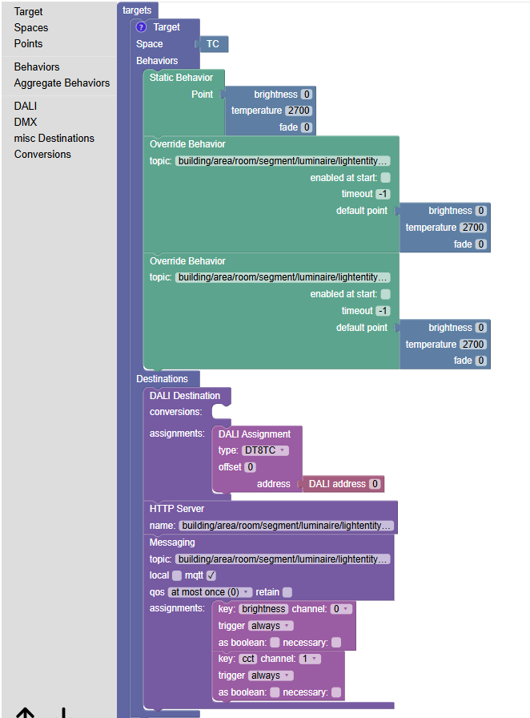
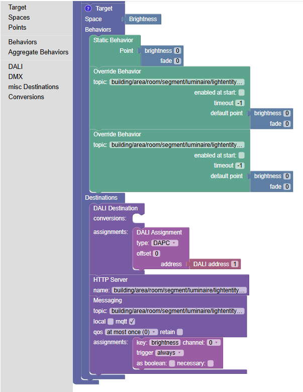
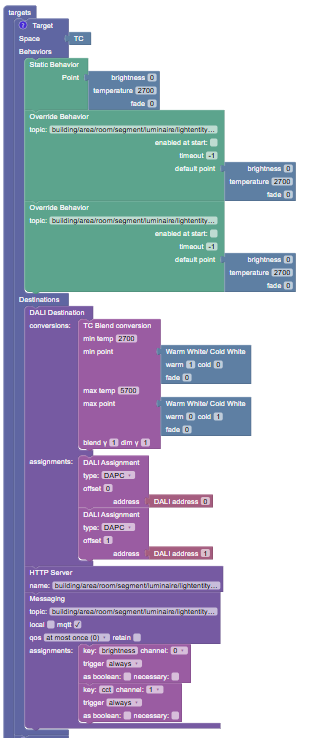
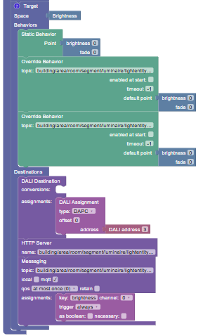

# PICOlightnode

Home-Assistant-Custom-Integration für PICO-Beleuchtungshardware mit MQTT-Steuerung. Das PICO-Gerät verwaltet DALI-Beleuchtung und stellt seine Targets über MQTT bereit.

> Also available in [English](README.md) | También disponible en [Español](README.es.md)

---

## Voraussetzungen

- Home Assistant 2024.1.0 oder neuer
- PICO-Hardware mit MQTT

---

## Installation

**Manuell:**

```bash
cd /config
unzip -o picolightnode_v2.0.20.zip
ha core restart
```

**HACS (Custom Repository):**

`https://github.com/mjmijh/picolightnode-ha` als Custom Repository in HACS hinzufügen, die Integration installieren und Home Assistant neu starten.

---

## Automationsmodi

PICOlightnode unterstützt drei Betriebsmodi. Du kannst jederzeit zwischen ihnen wechseln.

### Modus 1: Manuelle Steuerung

Direkte Steuerung über das Home-Assistant-Dashboard.

- Keine spezielle Konfiguration notwendig
- Follow-External-Schalter: **AUS**
- Smart Restore merkt sich Helligkeit und Farbtemperatur beim nächsten Einschalten

**Geeignet für:** Spontane Anpassungen, vollständige manuelle Kontrolle

---

### Modus 2: Interne Automation (PICO Daily Scheduler)

Das PICO-Gerät steuert sich selbst anhand eines in `setup.json` konfigurierten Tageszeit-Plans. Keine HA-Automationen notwendig.

- Follow-External-Schalter: **AUS**
- Funktioniert auch wenn Home Assistant offline ist
- Smart Restore: Ausschalten speichert den Modus „device" — Einschalten startet den PICO-Scheduler wieder

**Geeignet für:** Einfache zeitbasierte Steuerung, Standalone-Betrieb

---

### Modus 3: Externe Automation (Follow External)

Eine externe Automation (z. B. Keyframe Scheduler) steuert das Licht. PICOlightnode verfolgt Befehle der Automation und erkennt manuelle Eingriffe.

- Follow-External-Schalter: **EIN**
- Bei erkanntem manuellen Eingriff wird der Follow-External-Schalter automatisch deaktiviert
- Smart Restore nach Ausschalten aus dem Follow-Modus: Neustart im manuellen Modus mit gespeicherter Helligkeit — Follow wird absichtlich nicht automatisch wiederhergestellt, um Konflikte mit der Override-Erkennung externer Automationen zu vermeiden

**Geeignet für:** Komplexe Zeitpläne, sensorbasierte Anpassungen, Multi-Licht-Synchronisation

---

### Wechseln zwischen Modi

| Von | Nach | Vorgehensweise |
|-----|------|----------------|
| Manuell | Follow External | Follow-External-Schalter **EIN** |
| Follow External | Manuell | Helligkeit im Dashboard ändern — Follow deaktiviert sich automatisch |
| Follow External | Manuell | Follow-External-Schalter **AUS** |
| Beliebig | Interne Automation | Schaltfläche **Alle Overrides zurücksetzen** drücken |

---

## Entities

Für jedes konfigurierte Target werden folgende Entities erstellt:

| Entity | ID-Muster | Beschreibung |
|--------|-----------|--------------|
| Licht | `light.<target_name>` | Haupt-Light-Entity — Helligkeit und Farbtemperatur (TC-Modus) |
| Schalter | `switch.<target_name>_externe_automation_zulassen` | Follow-External-Schalter |
| Schaltfläche | — | Manuellen Override zurücksetzen |
| Schaltfläche | — | Automation-Override zurücksetzen |
| Schaltfläche | — | Alle Overrides zurücksetzen (kehrt zur internen Automation zurück) |

### Attribute der Light-Entity

| Attribut | Werte | Beschreibung |
|-----------|-------|--------------|
| `follow_external_automation` | `true` / `false` | Gibt an, ob der Follow-External-Modus aktiv ist |
| `mode_before_off` | `follow` / `device` / `manual` | Modus, der vor dem Ausschalten aktiv war |

---

## MQTT-Topics

| Topic | Richtung | Beschreibung |
|-------|----------|--------------|
| `<base_topic>/state` | Gerät → HA | Gerät publiziert den aktuellen Zustand (Helligkeit, CCT) |
| `<base_topic>/override/manual` | HA → Gerät | Integration sendet manuelle Override-Befehle |
| `<base_topic>/override/automation` | HA → Gerät | Integration sendet Automation-Override-Befehle |

---

## PICO-Konfiguration setup.json

Die Datei `setup.json` legt fest, welche Lichtkanäle (Targets) der PICO erzeugt, wie sie sich verhalten und wohin die berechneten Werte gesendet werden (DALI-Bus, MQTT, HTTP).

### DALI-Gerätetypen

| Typ | Beschreibung |
|-----|--------------|
| **DT8** | Natives Tunable White — einzelne DALI-Adresse, CCT wird nativ über `DT8TC` gesendet |
| **DT6** | Standard-DALI — CCT durch Mischung zweier separater DAPC-Kanäle (Warmweiß + Kaltweiß) |

**DT8** verwenden, wenn das Betriebsgerät DALI Device Type 8 vollständig implementiert. Für alle anderen CCT-Betriebsgeräte **DT6** verwenden.

Beispielkonfigurationen für beide Typen befinden sich in [`docs/examples/setup/`](docs/examples/setup/).

### DT8 — Blockly-Ansicht

**CCT-Target** (TC-Space, DT8TC-Assignment):



**Helligkeits-Target** (Brightness-Space, DAPC-Assignment):



### DT6 — Blockly-Ansicht

**CCT-Target** (TC-Space, TCBLEND-Konvertierung + 2× DAPC):



**Helligkeits-Target** (Brightness-Space, DAPC-Assignment):



### Aufbau

Eine `setup.json` ist ein JSON-Array von **Targets**. Jeder Target repräsentiert einen Lichtkanal.

```json
{
  "type"         : "TARGET",
  "space"        : "TC",
  "comment"      : "building/area/room/lightentityCCT",
  "behaviors"    : [...],
  "destinations" : [...]
}
```

**Behaviors** bestimmen den Lichtwert. Die Integration verwendet pro Target zwei Override-Behaviors — eines für Automationssteuerung (`/override/automation`) und eines für manuelle Steuerung (`/override/manual`).

**Destinations** legen fest, wohin der berechnete Wert gesendet wird: `DALI` (Bus-Ausgabe), `MESSAGING` (MQTT-Statuspublikation), `HTTPSERVER` (HTTP-Statusabfrage).

---

## Context Tracking

Alle internen Zustandsänderungen der Integration tragen die Context-ID `picolightnode_internal`. Dadurch können externe Blueprints (z. B. Keyframe Scheduler) zwischen Benutzeraktionen und integrationsinternen Aktualisierungen unterscheiden — Grundlage für eine zuverlässige manuelle Override-Erkennung.

---

## Verwandte Integrationen

| Integration | Repository |
|-------------|------------|
| Keyframe Scheduler | https://github.com/mjmijh/keyframe-scheduler |
| CCT Astronomy | https://github.com/mjmijh/cct-astronomy |

---

## Probleme und Support

https://github.com/mjmijh/picolightnode-ha/issues
